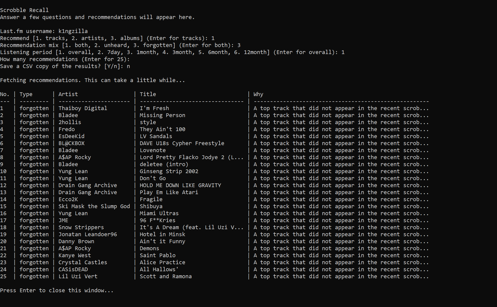

# Scrobble Recall

Scrobble Recall is a Python project that analyses a Last.fm user's listening history and produces two kinds of music recommendations:

- forgotten tracks, artists, or albums from deeper in the user's own listening history
- new recommendations that are verified against Last.fm user playcounts before being labelled as unplayed

The project started from a practical problem: normal recommendation systems often over-suggest the same obvious popular tracks, while Last.fm history can hide older favourites and overlooked related music.

## What It Demonstrates

- Working with a third-party REST API using only the Python standard library
- Ranking and filtering recommendations from noisy listening-history data
- Separating "forgotten" and "new" recommendations instead of mixing them into one score
- Guarding against false "new" recommendations with per-track, per-artist, and per-album user playcount checks
- A prompt-driven flow that runs by opening `main.py`
- Exporting results to CSV or JSON for analysis

## Quick Start

Create a Last.fm API key at <https://www.last.fm/api/account/create>.

Double-click `main.py`, or right-click it and open it with Python.

The first time you run it, the app will ask for your Last.fm API key. It can save the key in a `.env` file for next time:

```env
LASTFM_API_KEY=your_api_key_here
```

After that, the app will ask for:

- your Last.fm username
- whether you want tracks, artists, or albums
- whether you want forgotten, new, or both kinds of recommendations
- which listening period to use
- how many results you want
- whether to save a CSV copy in `exports/`

No runtime dependencies are required.

## Recommendation Approach

The app builds a profile from:

- recent tracks from Last.fm `user.getRecentTracks`
- top artists, tracks, and albums from the selected period
- a deeper all-time history sample used to filter out known items
- a small amount of related-artist data for discovery
- artist top tracks or albums, with the most obvious popular items skipped by default

Forgotten recommendations are taken from the user's own top history, but the first 25 all-time favourites are skipped by default. This is designed to avoid obvious rediscovery picks and surface items a listener may actually have lost track of.

New recommendations are filtered in two stages. First, the app removes anything found in the fetched listening history. Then it asks Last.fm for the user's playcount on each candidate and removes items with more than 0 plays.

## Useful Controls

- `Recommend`: choose tracks, artists, or albums.
- `Recommendation mix`: choose both, unheard, or forgotten.
- `Listening period`: choose overall, 7day, 1month, 3month, 6month, or 12month.
- `How many recommendations`: choose the number of results. When using both, this is the number per group.
- `Double-check zero plays`: confirms new recommendations against Last.fm playcounts. This is slower but stricter.
- `Save a CSV copy`: writes the results into the `exports/` folder.

## Example Output



## Limitations

- Last.fm data can contain duplicates, remasters, alternate spellings, and collaborations that are difficult to match perfectly.
- Strict new-item verification makes the app slower because it checks candidates individually.
- The recommender is intentionally explainable and configurable rather than a black-box machine-learning model.

